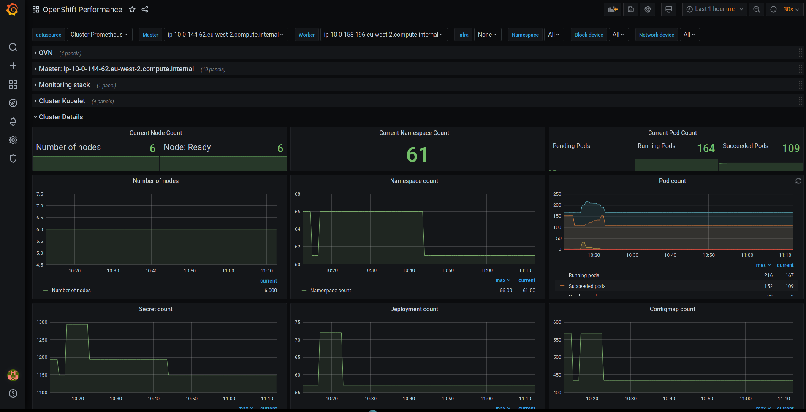

# Dittybopper



## whatis

Dittybopper is a quick-and-dirty way to deploy system-level submetric monitoring with Grafana
in an OpenShift 4 environment. It deploys a stand-alone mutable Grafana pod with default
dashboards to monitor things like CPU, memory, network, and disk activity.
The Grafana charts expect to receive metrics from an existing Prometheus
deployment and node exporters.

## Getting Started / Prerequisistes

Right now Dittybopper has a number of FIXMEs that need to be addressed before it will be more portable across
k8s/OpenShift environments. It should generally deploy out-of-the-box with OpenShift 4. Other environments
will likely have a prerequisite to first stand up a Prometheus pod, and the Dittybopper scripts and 
templates will need adjustment accordingly.

## Syncer Image and Deploying Forked Changes

For disconnected support, the syncer image stores all dashboards on it. For deploying dittybopper with changed
dashboards, you need to build it yourself from the root of the repository and update the SYNCER_IMAGE environment
variable to match your own image repository.

If using disconnected, you need to sync the cloud-bulldozer grafana image (shown in the
dittybopper/templates/dittybopper.yaml.template file) and your chosen syncer image
(defaults to quay.io/cloud-bulldozer/dittybopper-syncer:latest).

The syncer image is built with the context at the root of the repository, and the image in the root directory.
You can build it with `make build-syncer-image SYNCER_IMG_TAG=container.registry.org/organization/syncer:latest`
Alternatively, you can run the following command from the root folder of this repository: `podman build -f Dockerfile -t=container.registry.org/organization/syncer:latest .`

## Contribute

Pull requests are encouraged. If you find this tool useful, please help extend it for more use cases.

## Deploy

### Deploy Grafana on OpenShift Cluster with Dashboards

```
$ git clone https://github.com/cloud-bulldozer/performance-dashboards.git
$ cd performance-dashboards/dittybopper
$ ./deploy.sh [-c <kubectl_cmd>] [-n <namespace>] [-p <grafana_pwd>]
```

See `./deploy.sh -h` for help.

Simply running `./deploy.sh` with no flags will assume OpenShift, the _dittybopper_ namespace, and _admin_ for the password.

### Import Dashboard

This will import a dashboard (json) into an existing Dittybopper Grafana deployment. The dashboard path
can be either a local file or a URL beginning with http.

```
$ ./deploy.sh -i <path_to_dashboard_json_file>
```

### Delete Grafana Deployment

```
$ ./deploy.sh -d
```
